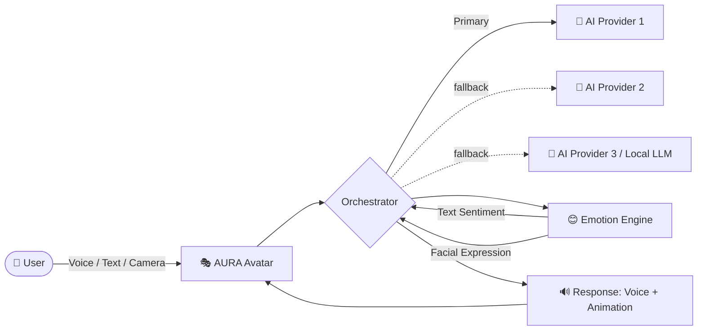
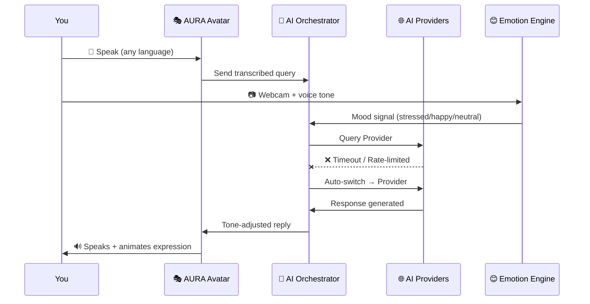
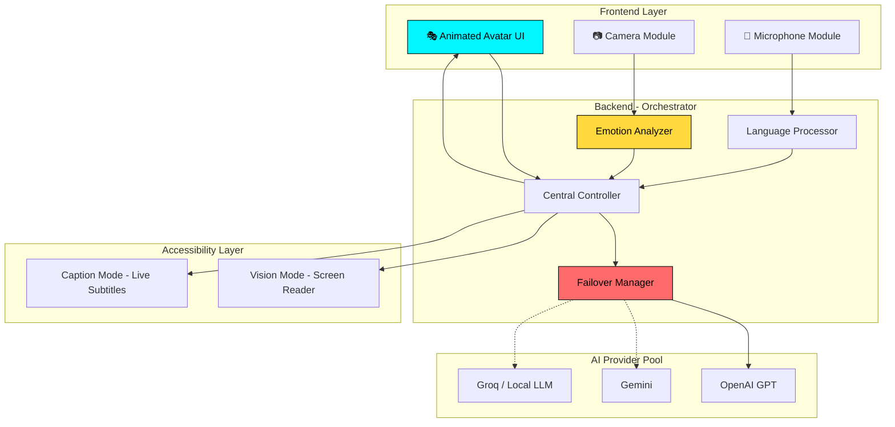

<div align="center">


<a href="#">
  
</a>

<br/>


</div>

---

## 🌟 What is AURA?

> **AURA (AI Unified Responsive Assistant)** is not just another chatbot.
> It's a **living, breathing digital companion** — an animated avatar that lives on your screen, listens to you, watches your expressions, talks in *your* language, and **never goes offline**, because if one AI brain fails, another silently takes over.

<div align="center">



</div>

---

## ✨ Core Features

<table>
<tr>
<td width="50%" valign="top">

### 🎭 Animated Living Avatar
A dynamic, expressive on-screen character that reacts in real time — idle, listening, thinking, and speaking animations bring AURA to life.

</td>
<td width="50%" valign="top">

### 🔄 Self-Healing AI Core
Multi-API failover with circuit-breaker logic. If one AI provider fails or rate-limits, AURA instantly switches to the next — **zero downtime, ever.**

</td>
</tr>
<tr>
<td width="50%" valign="top">

### 🌍 True Multilingual Support
Speak in Hindi, English, or any regional language — AURA understands and replies fluently in the same language, voice and all.

</td>
<td width="50%" valign="top">

### ♿ Accessibility First
**Vision Mode** narrates your entire screen for visually impaired users. **Caption Mode** provides live captions and visual alerts for hearing-impaired users.

</td>
</tr>
<tr>
<td width="50%" valign="top">

### 😊 Dual Emotion Detection
Reads your **mood from text/voice tone** AND your **facial expression via webcam** (with consent) — cross-checking both for genuinely empathetic responses.

</td>
<td width="50%" valign="top">

### 🖥️ Screen-Aware Intelligence
AURA can "see" your screen and explain errors, summarize documents, or guide you — like having a knowledgeable friend looking over your shoulder.

</td>
</tr>
</table>

---

## ⚙️ How AURA Works



---

## 🏗️ Tech Stack

<div align="center">
  
</div>

<div align="center">


</div>

---

## 🎯 Architecture Overview



---

## 🚀 Getting Started

```bash
# Clone the repository
git clone https://github.com/your-username/aura-ai.git
cd aura-ai

# Install backend dependencies
pip install -r requirements.txt

# Install frontend dependencies
cd frontend
npm install

# Run the project
npm run dev
```

> 📝 Add your API keys (OpenAI, Gemini, Groq, etc.) in a `.env` file before running.

---

## 🗺️ Roadmap

- [x] Animated avatar with expression states
- [x] Multi-API failover engine
- [ ] Multilingual voice conversation
- [ ] Webcam-based emotion detection
- [ ] Screen-awareness (OCR + context reading)
- [ ] Full Vision Mode for visually impaired users
- [ ] Sign-language gesture responses

---

## 📊 Project Stats

<div align="center">


</div>

---

## 🤝 Contributing

Contributions, issues, and feature requests are welcome!
Feel free to check the [issues page](https://github.com/shubhamm111-developer/aura-ai/issues).

---

## 📜 License

This project is licensed under the **MIT License** — see the [LICENSE](LICENSE) file for details.

---

<div align="center">

### 💙 Built with passion to make AI accessible, reliable, and human.


</div>
